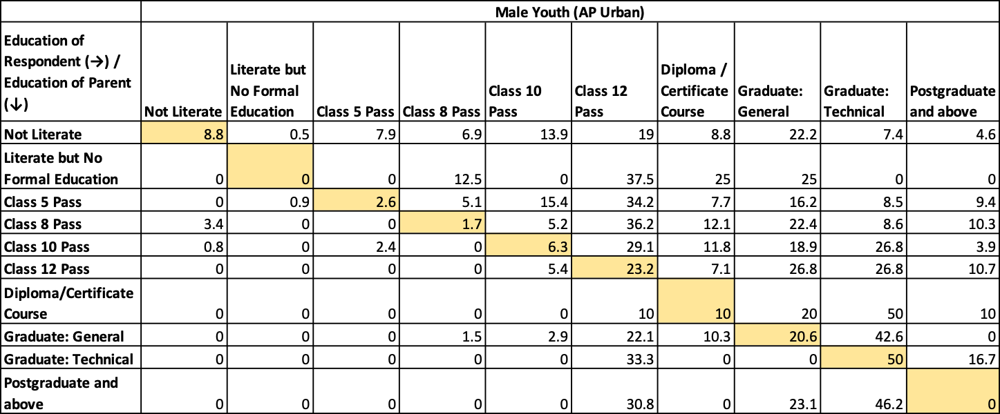
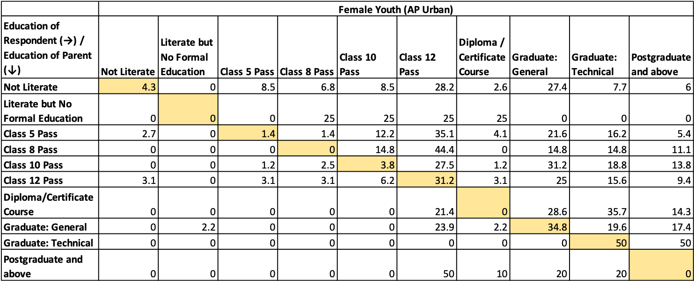
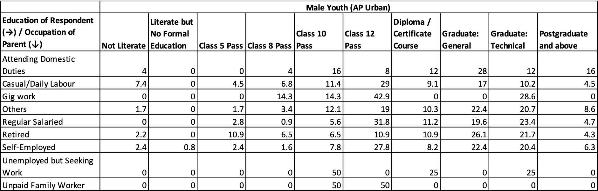
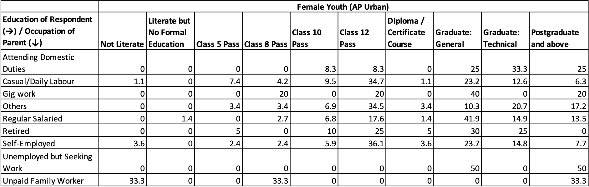

```{r setup, include=FALSE}
knitr::opts_chunk$set(echo = F)
library(data.table)
library(readxl)
library(writexl)
library(haven)
library(readr)
library(dplyr)
library(cowplot)
library(tidyverse)
library(ggplot2)
library(MASS)
library(ggrepel)
library(RColorBrewer)
library(stargazer)
library(DeclareDesign)
library(texreg)
library(car)
library(lubridate)
library(scales)
library(cowplot)
library(writexl)
library(janitor)
library(gridExtra)
library(grid)
library(ggpubr)
library(kableExtra)
library(data.table)
library(foreign)
library(readxl)
library(knitr)
library(tinytex)

##Plot theme
newtheme <- theme_bw() +
  theme(panel.border = element_rect(color = "darkgrey", size = 2), 
        panel.grid.major = element_blank(), legend.position = "bottom")

#Main Files ####
AP_Youth_Survey <- read_excel("youth_survey_responses (7th Feb).xlsx")
AP_Household_Roster <- read_excel("Household Roster Youth Survey (7th Feb).xlsx")
AP_Outmigration_Roster <- read_excel("Outmigration Roster Youth Survey (7th Feb).xlsx")


#Codebooks ####
AP_Youth_Survey_Codebook <- read_excel("AP_Youth_Survey_Codebook.xlsx")
colnames(AP_Youth_Survey) <- AP_Youth_Survey_Codebook$Variable_Name
attr(AP_Youth_Survey, "variable.labels") <- AP_Youth_Survey_Codebook$Column_Name

AP_Household_Roster_Codebook <- read_excel("AP_Youth_Survey_Codebook.xlsx", sheet = 2)
colnames(AP_Household_Roster) <- AP_Household_Roster_Codebook$Variable_Name
attr(AP_Household_Roster, "variable.labels") <- AP_Household_Roster_Codebook$Column_Name

AP_Outmigration_Roster_Codebook <- read_excel("AP_Youth_Survey_Codebook.xlsx", sheet = 3)
colnames(AP_Outmigration_Roster) <- AP_Outmigration_Roster_Codebook$Variable_Name
attr(AP_Outmigration_Roster, "variable.labels") <- AP_Outmigration_Roster_Codebook$Column_Name


AP_Youth_Survey_Merged <- merge(AP_Youth_Survey, AP_Household_Roster[AP_Household_Roster$H_1 == "Self",], by.x = c("_uuid"), by.y = c("_submission__uuid"))
attr(AP_Youth_Survey_Merged, "variable.labels") <- c(AP_Youth_Survey_Codebook$Column_Name, AP_Household_Roster_Codebook$Column_Name[AP_Household_Roster_Codebook$Column_Name != "_submission__uuid"])

#Wrapping functions
wrap.it <- function(x, len)
{ 
  sapply(x, function(y) paste(strwrap(y, len), 
                              collapse = "\n"), 
         USE.NAMES = FALSE)
}

wrap.labels <- function(x, len)
{
  if (is.list(x))
  {
    lapply(x, wrap.it, len)
  } else {
    wrap.it(x, len)
  }
}


```
\newpage

# List of flags encountered so far

## Absence of Self Respondents

We found that there are certain surveys which do not have any member of the household identified as the true respondent. According to the data by Jan 23, there are 21 such households. In total, there are about 64 respondents, once we remove children below 19, among which there are 21 true respondents who need to be identified through the face pages. Details on the same from the roster can be found below, and these have been merged with the main survey too. 

Face page references are also needed for 1 and 2(b) in the next section##

```{r, echo=FALSE, warning = F}
#Non Self data file
v <- AP_Youth_Survey$`_uuid`[(AP_Youth_Survey$`_uuid` %in% AP_Household_Roster$`_submission__uuid`[AP_Household_Roster$H_1 == "Self"]) == F]

#AP_Household_Roster$H_1[AP_Household_Roster$`_submission__uuid` %in% v]

AP_Household_NonSelf <- AP_Household_Roster[AP_Household_Roster$`_submission__uuid` %in% v,]
AP_Household_NonSelf <- AP_Household_NonSelf[AP_Household_NonSelf$Age > 18,]


for(i in 1:nrow(AP_Household_NonSelf)) {
  
  AP_Household_NonSelf[i,c(39:50)] = AP_Youth_Survey[AP_Youth_Survey$`_uuid` == AP_Household_NonSelf$`_submission__uuid`[i], c(1:12)]
  
}

head(AP_Household_NonSelf[,c(2:9)]) 


```

## Enumerator IDs entered as Respondent IDs

There are certain cases were it seems enumerator IDs have mistakenly been entered as respondent IDs. Given the last digit of the respondent ID is restricted to being less than 5, and the overall number should not exceed beyond 2100, we flagged certain IDs which were irregular. Upon crosschecking it seemed they were indeed enumerator IDs, and we are sharing a table of such IDs and the number of such responses below. 

```{r, echo=F, warning=F}

table(AP_Youth_Survey$`Enumerator Code`[AP_Youth_Survey$`Enumerator Code` == AP_Youth_Survey$`Respondent ID`])

```


## Misclassification of Adults as Children

There are about 16 cases where adults above the age of 19 have been entered as children. These are shown below. While they may all not necessarily be the respondent, these people need to be reclassified based on face pages.

```{r, echo=F, warning=F}

Child_MisClass <- AP_Household_Roster[AP_Household_Roster$Age > 19 & AP_Household_Roster$H_1 == "Child",]

Child_MisClass[,c(1:8)]
```

## Marital Status of Children

Marital status and children crosscheck - are there a lot of children?


## Disparities between Sector and Roster Occupation

Any disparities between respondent occupation and industry mentioned in the roster/survey responses?


Overall- Look at errors by enumerator IDs

# Observations from the Sample

## Capturing Seasonal and Long Term Employment

Roster captures - seasonal. 
Main Survey captures long term
There are certain cases where unemployed people have been counted as employed. We see that there's a large chunk of population that has been classified as employed based on the roster, but is unemployed in the main survey. Most of these responses seem to be from those engaged in casual/daily labour or self-employed, with unpaid family worker next in line


## Inertia on willingness for skill development
The skilling questions - we do see little movement from those who have not taken skilling courses/workshops in their willingness to take them in the future. 


\newpage

# Analysis of Survey Responses

## Upward Mobility

Distribution of Education in the Roster - First by Respondents

```{r, echo = F, warning=F, out.width=500}

Below_10 <- c("Class 5 Pass", "Class 8 Pass", "Don't know", "Not Literate", "Literate but No Formal Educaiton")
Above_12 <- c("Diploma/Certificate Course", "Graduate: General", "Graduate: Technical", "Postgraduate and above")

AP_Household_Roster$Educ_Rec <- ifelse(AP_Household_Roster$H_5 %in% Below_10, "Below Class 10",
                                       ifelse(AP_Household_Roster$H_5 %in% Above_12, "Above Class 12", AP_Household_Roster$H_5))


m1 <- as.data.frame(round(100*prop.table(table(AP_Household_Roster$H_5[AP_Household_Roster$H_1 == "Father"])),1))
m2 <- as.data.frame(round(100*prop.table(table(AP_Household_Roster$H_5[AP_Household_Roster$H_1 == "Mother"])),1)) 
m3 <- as.data.frame(round(100*prop.table(table(AP_Household_Roster$H_5[AP_Household_Roster$H_1 == "Self"])),1))

m <- merge(m1,m2, by=c("Var1"))
m <- merge(m, m3, by=c("Var1"))

order <- c(10,9,3,4,1,2,5,7,8,11)
m <- m[order,]; rownames(m) <- NULL

colnames(m) <- c("Highest Education Level", "Fathers", "Mothers", "Respondents")

m %>% 
kbl(caption = "Distribution of Highest Education Level: Household Roster", align = "l")%>%
  kable_classic(full_width = F, html_font = "Cambria", font_size = 11)

rm(m,m1,m2,m3)

```
Following are details of education levels distributed by age group - 

```{r, echo=F, warning=F, fig.width=10, fig.height=6}
Above_12 <- c(Above_12, "Class 12 Pass")

v <- nl <- groups <- rep(NA, 5)
le <- c(19,29,39,49,59)
ue <- c(28,38,48,58,80)

for (i in 1:5) {
  
  v[i] <- 100*sum(AP_Household_Roster$H_5[AP_Household_Roster$Age %in% le[i]:ue[i]] %in% Above_12)/sum(table(AP_Household_Roster$H_5[AP_Household_Roster$Age %in% le[i]:ue[i]]))
  nl[i] <- 100*sum(AP_Household_Roster$H_5[AP_Household_Roster$Age %in% le[i]:ue[i]] == "Not Literate",na.rm = T)/sum(table(AP_Household_Roster$H_5[AP_Household_Roster$Age %in% le[i]:ue[i]]))
  groups[i] <- paste(le[i],ue[i], sep="-")
  
}

bp <- barplot(as.matrix(rbind(v,nl)), beside = T, names.arg = groups, col = c("dodgerblue3", "skyblue"), border = NA, main = "Distribution of Educational Qualification by Age Group", xlab = "Age Group",
        ylab = "Percentage within Age Group", las = 1, ylim = c(0,75), legend.text = c("Class 12 and Above", "Not Literate"), args.legend = list(x = "top", bty = "n", border = "white", horiz = T))
text(bp, as.matrix(rbind(v,nl)), round(as.matrix(rbind(v,nl))), pos = 3)

```

\newpage
Education of Children to Parent’s education (Father's) - Breakdown by male and female (Comparison with PLFS)

```{r, echo = F, warning = F, out.width=500}
M <- as.data.table(AP_Household_Roster)
M$UID = M$`_submission__uuid`
M$Ma <- M$Gender == "Male" & M$H_1 == "Self"
M$Fa <- M$Gender == "Female" & M$H_1 == "Self"
M$UID = M$`_submission__uuid`

Mal <- M$`_submission__uuid`[M$Ma == T]
Fal <- M$`_submission__uuid`[M$Fa == T]

Male <- M[UID %in% Mal,.(Father_Ed = H_5[H_1 == "Father"], Self_Ed = H_5[H_1 == "Self"]), by=c("UID")]

Female <- M[UID %in% Fal,.(Father_Ed = H_5[H_1 == "Father"], Self_Ed = H_5[H_1 == "Self"]), by=c("UID")]


x1 <- round(100*prop.table(table(Male$Father_Ed, Male$Self_Ed), 1), 1)
x2 <- round(100*prop.table(table(Female$Father_Ed, Female$Self_Ed), 1), 1)




rm(x1,x2)

```
\newpage

Distribution of Father's Occupation

```{r}
c <- as.data.frame(round(100*prop.table(table(AP_Household_Roster$H_6[AP_Household_Roster$H_1 == "Father"])),1))
colnames(c) <- c("Father's Occupation", "Percentage")

c %>% 
  kbl(caption = "Distribution of Father's Occupation: Household Roster", align = "l")%>%
  kable_classic(full_width = F, html_font = "Cambria", font_size = 11)
  
```


Tables for occupation of parent and education of respondent

```{r, echo = F, warning = F, out.width=500}
M <- as.data.table(AP_Household_Roster)
M$UID = M$`_submission__uuid`
Male <- M[UID %in% Mal,.(Father_PA = H_6[H_1 == "Father"], Self_Ed = H_5[H_1 == "Self"]), by=c("UID")]

Female <- M[UID %in% Fal,.(Father_PA = H_6[H_1 == "Father"], Self_Ed = H_5[H_1 == "Self"]), by=c("UID")]

a1 <- round(100*prop.table(table(Male$Father_PA, Male$Self_Ed), 1), 1)
a2 <- round(100*prop.table(table(Female$Father_PA, Female$Self_Ed), 1), 1)






rm(M, Mal, Fal, a1, a2)

```
\newpage

## Demographic Analysis (Section A)

```{r, echo=F, warning=F, out.width= 500}
##Household Composition
ch <- as.data.frame (table(AP_Household_Roster$H_1)) %>% 
rename("Relationship with the respondent" = Var1) %>% 
rename ("Count" = Freq) %>% 
arrange (desc(Count))


ch %>% 
kbl(caption = "Composition of households", align = "l")%>%
  kable_classic(full_width = F, html_font = "Cambria", font_size = 11)

##Youth respondent disaggregated by Gender
g1 <- as.data.frame(table(AP_Household_Roster$Gender[AP_Household_Roster$H_1 == "Self"])) %>% 
mutate (Proportions = Freq*100/sum(Freq)) %>% 
rename ("Gender" = Var1) %>% 
rename ("Count" = Freq)

#Male respondents: 960 (49%); Women Respondents: 999 (51%)
#Note: 21 self-respondents wrongly marked 

##Other members of the household (Household Roster) disaggregated by Gender
g2 <- as.data.frame(table(AP_Household_Roster$Gender[AP_Household_Roster$H_1 == "Brother" | AP_Household_Roster$H_1 == "Child" | AP_Household_Roster$H_1 == "Father" | AP_Household_Roster$H_1 == "Father-in-law"  | AP_Household_Roster$H_1 == "Grandfather" | AP_Household_Roster$H_1 == "Grandmother" | AP_Household_Roster$H_1 == "Husband" | AP_Household_Roster$H_1 == "Mother" |AP_Household_Roster$H_1 == "Mother-in-law"|AP_Household_Roster$H_1 == "Non-Relatives (guests, servants, help, etc.)" | AP_Household_Roster$H_1 == "Other Relatives"| AP_Household_Roster$H_1 == "Other-in-laws"| AP_Household_Roster$H_1 == "Sister"| AP_Household_Roster$H_1 == "Uncle/Aunt"| AP_Household_Roster$H_1 == "Wife"])) %>% 
mutate (Proportions = Freq*100/sum(Freq)) %>% 
rename ("Gender" = Var1) %>% 
rename ("Count" = Freq)

#Male Members:
```


Government Caste Categories (by household)


```{r, echo=F, warning=F, fig.width=10, fig.height=6}
##Government Caste Categories (by household)
caste <- as.data.frame(table(AP_Youth_Survey$Y_A_15)) %>% 
mutate (Proportions = round(Freq*100/sum(Freq),1)) %>% 
rename ("Household Caste Category" = Var1) %>% 
rename ("Count" = Freq)


caste_plot <- ggplot(caste, aes(x= `Household Caste Category`, y= Proportions, fill = `Household Caste Category`)) +
  geom_bar(stat="identity", width= 0.5, show.legend = FALSE) + 
  geom_text (aes(label = Proportions), position = position_dodge(0.1), vjust = -1) + scale_y_continuous(limits = c(0,70)) +
  scale_x_discrete(labels = function(`Household Caste Category`) str_wrap(`Household Caste Category`, width = 10)) +
  scale_fill_brewer(palette="YlGnBu") +
  labs(x="",y="Percentage") + newtheme

caste_plot
```

Household Religion


```{r, echo=F, warning=F, fig.width=10, fig.height=6}
##Religion of Households
religion <- as.data.frame(table(AP_Youth_Survey$Y_A_13)) %>% 
mutate (Proportions = round(Freq*100/sum(Freq),1)) %>% 
rename ("Religion of Household" = Var1) %>% 
rename ("Count" = Freq) 

religion_plot <- ggplot(religion, aes(x= `Religion of Household`, y= Proportions, fill = `Religion of Household`)) +
  geom_bar(stat="identity", width= 0.5, show.legend = FALSE) + 
  geom_text (aes(label = Proportions), position = position_dodge(0.1), vjust = -1) +
  scale_y_continuous(limits = c(0,80)) +
  scale_x_discrete(labels = function(`Religion of Household`) str_wrap(`Religion of Household`, width = 10)) +
  scale_fill_brewer(palette="YlGnBu") +
  labs(x="",y="Percentage") + newtheme

religion_plot
```
\newpage

## Youth Questions (Section G) 
Q. Do you think your economic fortunes will be better or worse than your parents? (Y_G_186)
```{r, echo=F, warning=F, fig.height=6, fig.width=10}
##Y_G_186
Y_G_186 <- as.data.frame(table(AP_Youth_Survey$Y_G_186)) %>% 
mutate (Proportions = round(Freq*100/sum(Freq),1)) %>% 
rename ("Response" = Var1) %>% 
rename ("Count" = Freq) 

Y_G_186$Response <- as.factor(Y_G_186$Response)

Y_G_186$Response <- factor(Y_G_186$Response, levels = c("Much Worse", "Somewhat Worse", "No Response", "Somewhat Better", "Much Better"))

Y_G_186_plot <- ggplot(Y_G_186[ order(as.numeric(row.names(Y_G_186))), ], aes(x= Response, y= Proportions, fill = Response)) +
  geom_bar(stat="identity", width= 0.5, show.legend = FALSE) + 
  geom_text (aes(label = Proportions), position = position_dodge(0.1), vjust = -1) +
  scale_y_continuous(limits = c(0,80)) +
  scale_x_discrete(labels = function(`Response`) str_wrap(`Response`, width = 10)) +
  scale_fill_brewer(palette="YlGnBu") +
  labs(x="",y="Percentage") + newtheme

Y_G_186_plot

```
\newpage

Q. In the past 5 years, compared to other states in India, do you believe citizens of Andhra Pradesh have done better or worse? (Y_G_187)


```{r, echo = FALSE, fig.height=5, fig.width=10, warning=FALSE}
##Y_G_187
Y_G_187 <- as.data.frame(table(AP_Youth_Survey$Y_G_187)) %>% 
mutate (Proportions = round(Freq*100/sum(Freq),1)) %>% 
rename ("Response" = Var1) %>% 
rename ("Count" = Freq) 

Y_G_187$Response <- as.factor(Y_G_187$Response)

Y_G_187$Response <- factor(Y_G_187$Response, levels = c("Much Worse", "Somewhat Worse", "No Response", "Somewhat Better", "Much Better"))

Y_G_187_plot <- ggplot(Y_G_187, aes(x= Response, y= Proportions, fill = Response)) +
  geom_bar(stat="identity", width= 0.5, show.legend = FALSE) + 
  geom_text (aes(label = Proportions), position = position_dodge(0.1), vjust = -1) +
  scale_y_continuous(limits = c(0,80)) +
  scale_x_discrete(labels = function(`Response`) str_wrap(`Response`, width = 10)) +
  scale_fill_brewer(palette="YlGnBu") +
  labs(x="",y="Percentage") + newtheme

Y_G_187_plot
```

Q. Andhra Pradesh now has many cash schemes to give money to its citizens, like Ammavodi and YSR Cheyutha. Do you believe the amount given in cash schemes should be more or less? (Y_G_188)

```{r, echo=F, warning=F, fig.height=5, fig.width=10}
Y_G_188 <- as.data.frame(table(AP_Youth_Survey$Y_G_188)) %>% 
mutate (Proportions = round(Freq*100/sum(Freq),1)) %>% 
rename ("Response" = Var1) %>% 
rename ("Count" = Freq) 

Y_G_188$Response <- as.factor(Y_G_188$Response)

Y_G_188$Response <- factor(Y_G_188$Response, levels = c("Much Less", "Somewhat Less", "No Response", "Somewhat More", "Much More"))

Y_G_188_plot <- ggplot(Y_G_188, aes(x= Response, y= Proportions, fill = Response)) +
  geom_bar(stat="identity", width= 0.5, show.legend = FALSE) + 
  geom_text (aes(label = Proportions), position = position_dodge(0.1), vjust = -1) +
  scale_y_continuous(limits = c(0,80)) +
  scale_x_discrete(labels = function(`Response`) str_wrap(`Response`, width = 10)) +
  scale_fill_brewer(palette="YlGnBu") +
  labs(x="",y="Percentage") + newtheme

Y_G_188_plot

```
\newpage

Q. Do you believe democracy in India is getting stronger or weaker? (Y_G_189)

```{r, echo=F, warning=F, fig.height=6, fig.width=10}
Y_G_189 <- as.data.frame(table(AP_Youth_Survey$Y_G_189)) %>% 
mutate (Proportions = round(Freq*100/sum(Freq),1)) %>% 
rename ("Response" = Var1) %>% 
rename ("Count" = Freq) 

Y_G_189$Response <- as.factor(Y_G_189$Response)

Y_G_189$Response <- factor(Y_G_189$Response, levels = c("Much Weaker", "Somewhat Weaker", "No Response", "Somewhat Stronger", "Much Stronger"))

Y_G_189_plot <- ggplot(Y_G_189, aes(x= Response, y= Proportions, fill = Response)) +
  geom_bar(stat="identity", width= 0.5, show.legend = FALSE) + 
  geom_text (aes(label = Proportions), position = position_dodge(0.1), vjust = -1) +
  scale_y_continuous(limits = c(0,80)) +
  scale_x_discrete(labels = function(`Response`) str_wrap(`Response`, width = 10)) +
  scale_fill_brewer(palette="YlGnBu") +
  labs(x="",y="Percentage") + newtheme

Y_G_189_plot
```
\newpage

## Social Security and Scheme based receipts (Section E)
Scheme based benefit receipts & Credit attribution (Clean Y_E_75 and associated q):

First, how many respondents have claimed to receive at least some benefit or the other

```{r, echo = F, fig.width=10, fig.height=6, warning=F}

Neg_Resp <- c("No", "Don't Know", "Don't know")

vec <- c(62, 67, 72, 77, 82) + 1

c <- cbind.data.frame(Col_No = as.numeric(vec), Var_Codes = colnames(AP_Youth_Survey_Merged)[vec], Q_Name = AP_Youth_Survey_Codebook$Column_Name[vec - 1])

Yes_Resp <- Tot_Resp <- rep(NA, length(vec))

for (i in 1:nrow(c)) {
  
  t <- as.data.frame(table(AP_Youth_Survey_Merged[,c$Col_No[i]] %in% Neg_Resp))
  Yes_Resp[i] <- t$Freq[t$Var1 == F]
  Tot_Resp[i] <- sum(t$Freq, na.rm = T)
  
  
}

c <- cbind.data.frame(c, Yes_Resp, Tot_Resp)
c$Benefit_Rate = round(100*c$Yes_Resp/c$Tot_Resp, 2)

names <- c("Housing", "Education", "Health", "Cash Support", "Business Support/Loan")

bp <- barplot(c$Benefit_Rate, names.arg = names, ylim = c(0,55), border = NA, col = "dodgerblue", main = "Proportion of Respondents Covered by Schemes", xlab = "Scheme", ylab = "Percentage of Respondents")
text(bp, c$Benefit_Rate, round(c$Benefit_Rate, 1), pos = 3)
```


Now for who they attribute the credit to - Very little to centre in most cases, overwhelmingly state.
This is also because in the yes responses when we look at which scheme, it is mostly the state scheme they claim to receive benefits under

\vspace{6mm}
```{r, echo = F, warning=F, out.width=500}
#Attribution
vec <- c(62, 67, 72, 77, 82) + 3

State_Att <- Cent_Att <- Both_Att <- Local_Att <- rep(NA, nrow(c))

for (i in 1:nrow(c)) {
  
  t <- as.data.frame(table(AP_Youth_Survey_Merged[,vec[i]]))
  State_Att[i] <- t$Freq[t$Var1 == "State Government"]
  Cent_Att[i] <- t$Freq[t$Var1 == "Central Government"]
  Both_Att[i] <- t$Freq[t$Var1 == "Both State and Central Government"]

}

d <- cbind.data.frame(names, State_Att = State_Att/c$Yes_Resp, Cent_Att = Cent_Att/c$Yes_Resp, Both_Att = Both_Att/c$Yes_Resp)

d[,c(2:4)] <- 100*round(d[,c(2:4)], 4)

d %>% 
kbl(caption = "Attribution for Social Schemes", align = "l", col.names = c("Scheme", "State Government", "Central Government", "Both State and Centre"))%>%
  kable_classic(full_width = F, html_font = "Cambria", font_size = 11)

```
\newpage

## Primary Activity Details, Employment and Skilling (Section F)

1. Primary Activity - Employment Distribution (Primary Activity) - 19-29 and 30+ (across gender)

For 19-29

```{r, echo=F, warning=F, fig.width=10, fig.height=6}
OO_LF <- c("Attending Domestic Duties", "Student", "Others", "Retired", NA)

t <- as.data.frame(table(AP_Household_Roster$H_6[AP_Household_Roster$Age %in% 19:29 & (AP_Household_Roster$H_6 %in% OO_LF) == F]))

bp <- barplot(100*prop.table(t$Freq), names.arg = wrap.labels(t$Var1, 20), ylim = c(0,50), border = NA, col = "darkblue", main = "Structure of Employment Among Youth", xlab = "Primary Activity", ylab = "Percentage of Labour Force", cex.names = 0.75)
text(bp, 100*prop.table(t$Freq), round(100*prop.table(t$Freq)), pos = 3)

```

For 30+

```{r, echo=F, fig.width=10, fig.height=5, warning=F}
OO_LF <- c("Attending Domestic Duties", "Student", "Others", "Retired", NA)

t <- as.data.frame(table(AP_Household_Roster$H_6[AP_Household_Roster$Age > 30 & (AP_Household_Roster$H_6 %in% OO_LF) == F]))

bp <- barplot(100*prop.table(t$Freq), names.arg = wrap.labels(t$Var1, 20), ylim = c(0,50), border = NA, col = "darkred", main = "Structure of Employment Among Adults (30+)", xlab = "Primary Activity", ylab = "Percentage of Labour Force", cex.names = 0.75)
text(bp, 100*prop.table(t$Freq), round(100*prop.table(t$Freq)), pos = 3)

```
\newpage

Breakdown of youth into separate groups

```{r, echo=F, warning=F, fig.width=10, fig.height=6}
OO_LF <- c("Attending Domestic Duties", "Student", "Others", "Retired", NA)

t1 <- as.data.frame(table(AP_Household_Roster$H_6[AP_Household_Roster$Age %in% 19:24 & (AP_Household_Roster$H_6 %in% OO_LF) == F]))

t2 <- as.data.frame(table(AP_Household_Roster$H_6[AP_Household_Roster$Age %in% 25:29 & (AP_Household_Roster$H_6 %in% OO_LF) == F]))

x <- as.matrix(cbind(100*prop.table(t1$Freq), 100*prop.table(t2$Freq)))

bp <- barplot(t(x), beside = T, names.arg = wrap.labels(t1$Var1, 20), ylim = c(0,50), border = "white", col = c("coral2", "dodgerblue"), main = "Structure of Employment Among Youth", xlab = "Primary Activity", ylab = "Percentage of Labour Force", cex.names = 0.75, legend.text = c("Ages 19-24", "Ages 25-29"), args.legend = list(x = "top", bty = "n", border = "white", horiz = T))

text(bp, t(x), round(t(x)), pos = 3, cex = 0.75)

```

Breakdown of employment structure by gender. 

```{r, echo=F, warning=F, fig.width=10, fig.height=6}
OO_LF <- c("Attending Domestic Duties", "Student", "Others", "Retired")

t1 <- as.data.frame(table(AP_Household_Roster$H_6[AP_Household_Roster$Age %in% 19:29 & (AP_Household_Roster$H_6 %in% OO_LF) == F & AP_Household_Roster$Gender == "Male"]))
t1$Freq <- t1$Freq/sum(t1$Freq)

t2 <- as.data.frame(table(AP_Household_Roster$H_6[AP_Household_Roster$Age %in% 19:29 & (AP_Household_Roster$H_6 %in% OO_LF) == F & AP_Household_Roster$Gender == "Female"]))
t2$Freq <- t2$Freq/sum(t2$Freq)

t <- merge(t1, t2, by = c("Var1"))

bp <- barplot(t(100*t[,c(2:3)]), beside = T, names.arg = wrap.labels(t$Var1, 20), ylim = c(0,50), border = "white", col = c("dodgerblue","coral2"), main = "Structure of Employment Among Youth (by Gender)", xlab = "Primary Activity", ylab = "Percentage of Labour Force", cex.names = 0.8, legend.text = c("Male", "Female"), args.legend = list(x = "top", bty = "n", border = "white", horiz = T))

text(bp, 100*t(t[,-1]), round(100*t(t[,-1])), pos = 3, cex = 0.75)
```

\newpage


Skilling - We are mainly analysing three things. First, have you taken a course already (Enrolment). Second, do you think any of the skilling courses would be beneficial (Interested). Finally, would youenroll in one (Intent). 

```{r, echo=FALSE, warning = F}
#Combining Skill Question Columns 
#In main survey
AP_Youth_Survey$YR_F_87 <- ifelse(AP_Youth_Survey$Y_F_81 == "Student", AP_Youth_Survey$Y_F_87,
                                  ifelse(AP_Youth_Survey$Y_F_81 == "Employed", AP_Youth_Survey$Y_F_123, AP_Youth_Survey$Y_F_160))

AP_Youth_Survey$YR_F_92 <- ifelse(AP_Youth_Survey$Y_F_81 == "Student", AP_Youth_Survey$Y_F_92,
                                  ifelse(AP_Youth_Survey$Y_F_81 == "Employed", AP_Youth_Survey$Y_F_128, AP_Youth_Survey$Y_F_165))

AP_Youth_Survey$YR_F_94 <- ifelse(AP_Youth_Survey$Y_F_81 == "Student", AP_Youth_Survey$Y_F_94,
                                  ifelse(AP_Youth_Survey$Y_F_81 == "Employed", AP_Youth_Survey$Y_F_130, AP_Youth_Survey$Y_F_167))


```

Taking Skilling Courses - 
Q. Would skill training in any of the following areas be beneficial for your professional goals?

```{r, echo=F, message=FALSE, warning=F, fig.width = 10, fig.height=5}
attach(AP_Youth_Survey)
a1 <- as.data.frame(table(YR_F_87 == "No")); a1$Freq <- round(100*a1$Freq/sum(a1$Freq), 2)

a2 <- as.data.frame(table(YR_F_87[Y_F_81 == "Student"] == "No")); a2$Freq <- round(100*a2$Freq/sum(a2$Freq), 2)

a3 <- as.data.frame(table(YR_F_87[Y_F_81 == "Employed"] == "No")); a3$Freq <- round(100*a3$Freq/sum(a3$Freq), 2)

a4 <- as.data.frame(table(YR_F_87[Y_F_81 == "Unemployed"] == "No")); a4$Freq <- round(100*a4$Freq/sum(a4$Freq), 2)  

v <- c(a1$Freq[a1$Var1 == F], a2$Freq[a2$Var1 == F], a3$Freq[a3$Var1 == F], a4$Freq[a4$Var1 == F])
  
bp <- barplot(v, col = c("navyblue", "dodgerblue3", "dodgerblue", "skyblue2"), border = NA, las = 1, ylim = c(0,35), main = "Proportion of Respondents with Skilling Courses", names.arg = c('Overall', 'Student', 'Employed', 'Unemployed'), xlab = "Category", ylab = "Percentage within Category")
text(bp, v, round(v, 1), pos = 3)

rm(a1,a2,a3,a4,v)

```

Interest in taking Skilling Courses -
Q. Would skill training in any of the following areas be beneficial for your professional goals?

```{r, echo=F, message=FALSE, warning=F, fig.width = 10, fig.height=5}
a1 <- as.data.frame(table(YR_F_92 == "No")); a1$Freq <- round(100*a1$Freq/sum(a1$Freq), 2)

a2 <- as.data.frame(table(YR_F_92[Y_F_81 == "Student"] == "No")); a2$Freq <- round(100*a2$Freq/sum(a2$Freq), 2)

a3 <- as.data.frame(table(YR_F_92[Y_F_81 == "Employed"] == "No")); a3$Freq <- round(100*a3$Freq/sum(a3$Freq), 2)

a4 <- as.data.frame(table(YR_F_92[Y_F_81 == "Unemployed"] == "No")); a4$Freq <- round(100*a4$Freq/sum(a4$Freq), 2)  

v <- c(a1$Freq[a1$Var1 == F], a2$Freq[a2$Var1 == F], a3$Freq[a3$Var1 == F], a4$Freq[a4$Var1 == F])
  
bp <- barplot(v, col = c("navyblue", "dodgerblue3", "dodgerblue", "skyblue2"), border = NA, las = 1, ylim = c(0,55), main = "Proportion of Respondents Interested in taking Skilling Courses", names.arg = c('Overall', 'Student', 'Employed', 'Unemployed'), xlab = "Category", ylab = "Percentage within Category")
text(bp, v, round(v, 1), pos = 3)


rm(a1,a2,a3,a4,v)
```
\newpage


Intention of Interested Respondents to Take Courses
Q. Do you intend to take up formal or informal courses for this skills training in the near future?

```{r, echo=F, message=FALSE, warning=F, fig.width = 10, fig.height=5}
a1 <- as.data.frame(table(YR_F_94 == "No")); a1$Freq <- round(100*a1$Freq/sum(a1$Freq), 2)

a2 <- as.data.frame(table(YR_F_94[Y_F_81 == "Student"] == "No")); a2$Freq <- round(100*a2$Freq/sum(a2$Freq), 2)

a3 <- as.data.frame(table(YR_F_94[Y_F_81 == "Employed"] == "No")); a3$Freq <- round(100*a3$Freq/sum(a3$Freq), 2)

a4 <- as.data.frame(table(YR_F_94[Y_F_81 == "Unemployed"] == "No")); a4$Freq <- round(100*a4$Freq/sum(a4$Freq), 2)  

v <- c(a1$Freq[a1$Var1 == F], a2$Freq[a2$Var1 == F], a3$Freq[a3$Var1 == F], a4$Freq[a4$Var1 == F])
  
bp <- barplot(v, col = c("navyblue", "dodgerblue3", "dodgerblue", "skyblue2"), border = NA, las = 1, ylim = c(0,100), main = "Interested Respondents Intending to take Skilling Courses", names.arg = c('Overall', 'Student', 'Employed', 'Unemployed'), xlab = "Category", ylab = "Percentage within Category")
text(bp, v, round(v, 1), pos = 3)

rm(a1,a2,a3,a4,v)

detach(AP_Youth_Survey)
```

Enrolment and Interest by Type of Course:
Sharing below absolute numbers for people currently enrolled in courses and those interested in taking them.

```{r, echo = F, warning = F, out.width=500, out.height=150}
#Category Wise Enrolment
IT <- table(grepl(c("Information Technology"), AP_Youth_Survey$YR_F_87, ignore.case = T) | grepl(c("Computer"), AP_Youth_Survey$YR_F_87, ignore.case = T),
            AP_Youth_Survey$Y_F_81)
English <- table(grepl(c("English"), AP_Youth_Survey$YR_F_87, ignore.case = T) | grepl(c("Communication"), AP_Youth_Survey$YR_F_87, ignore.case = T),
                 AP_Youth_Survey$Y_F_81)
Competitive_Exam <- table(grepl(c("Competitive Exam"), AP_Youth_Survey$YR_F_87, ignore.case = T),
                          AP_Youth_Survey$Y_F_81)
Eng_Science <- table(grepl(c("Engineering"), AP_Youth_Survey$YR_F_87, ignore.case = T) | grepl(c("Science"), AP_Youth_Survey$YR_F_87, ignore.case = T),
                     AP_Youth_Survey$Y_F_81)
Repair <- table(grepl(c("Technical"), AP_Youth_Survey$YR_F_87, ignore.case = T) | grepl(c("Repair"), AP_Youth_Survey$YR_F_87, ignore.case = T),
                AP_Youth_Survey$Y_F_81)
Craftwork <- table(grepl(c("Craftwork"), AP_Youth_Survey$YR_F_87, ignore.case = T),
                   AP_Youth_Survey$Y_F_81)

cbl <- cbind(IT[2,], English[2,], Competitive_Exam[2,], Eng_Science[2,], Repair[2,], Craftwork[2,])
colnames(cbl) <- c("IT", "English", "Competitive Exam", "Engineering/Science", "Technical/Repair", "Craftwork")

cbl <- rbind(cbl, Total = colSums(cbl))

cbl %>%
  kbl(caption = "Distribution of Enrolment in Skilling Courses", align = "l")%>%
  kable_classic(full_width = F, html_font = "Cambria", font_size = 11) %>%
  row_spec(4, bold = T)

```

```{r, echo = F, warning = F, out.width=500, out.height=150}
#Category wise Interest
IT <- table(grepl(c("Information Technology"), AP_Youth_Survey$YR_F_92, ignore.case = T) | grepl(c("Computer"), AP_Youth_Survey$YR_F_92, ignore.case = T),
            AP_Youth_Survey$Y_F_81)
English <- table(grepl(c("English"), AP_Youth_Survey$YR_F_92, ignore.case = T) | grepl(c("Communication"), AP_Youth_Survey$YR_F_92, ignore.case = T),
                 AP_Youth_Survey$Y_F_81)
Competitive_Exam <- table(grepl(c("Competitive Exam"), AP_Youth_Survey$YR_F_92, ignore.case = T),
                          AP_Youth_Survey$Y_F_81)
Eng_Science <- table(grepl(c("Engineering"), AP_Youth_Survey$YR_F_92, ignore.case = T) | grepl(c("Science"), AP_Youth_Survey$YR_F_92, ignore.case = T),
                     AP_Youth_Survey$Y_F_81)
Repair <- table(grepl(c("Technical"), AP_Youth_Survey$YR_F_92, ignore.case = T) | grepl(c("Repair"), AP_Youth_Survey$YR_F_92, ignore.case = T),
                AP_Youth_Survey$Y_F_81)
Craftwork <- table(grepl(c("Craftwork"), AP_Youth_Survey$YR_F_92, ignore.case = T),
                   AP_Youth_Survey$Y_F_81)

cbl <- cbind(IT[2,], English[2,], Competitive_Exam[2,], Eng_Science[2,], Repair[2,], Craftwork[2,])
colnames(cbl) <- c("IT", "English", "Competitive Exam", "Engineering/Science", "Technical/Repair", "Craftwork")

cbl <- rbind(cbl, Total = colSums(cbl))

cbl %>%
  kbl(caption = "Distribution of Interest in Skilling Courses", align = "l")%>%
  kable_classic(full_width = F, html_font = "Cambria", font_size = 11) %>%
  row_spec(4, bold = T)

```


\newpage

# Potential Next Steps

1. Running a sample crosscheck with GSWS data to see data quality and check consistency? - Neelan to take session
2. Recode string variable values across the survey and roster
3. Merge response to skilling questions into one column, so far separated by response on primary activity
4. Other internal data checks could include?